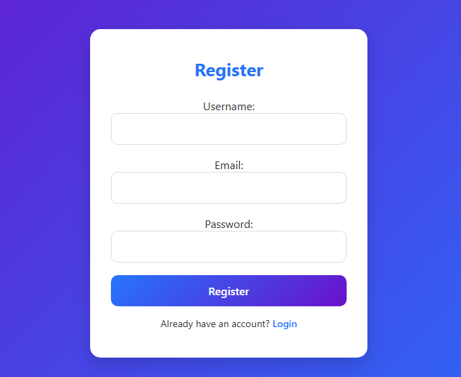
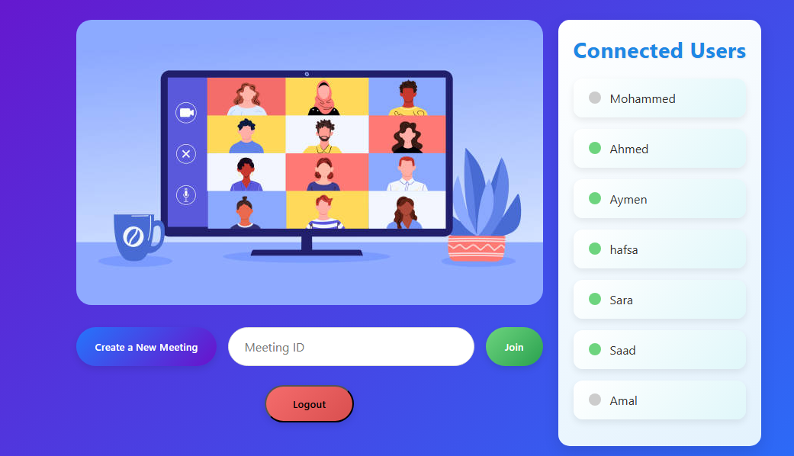
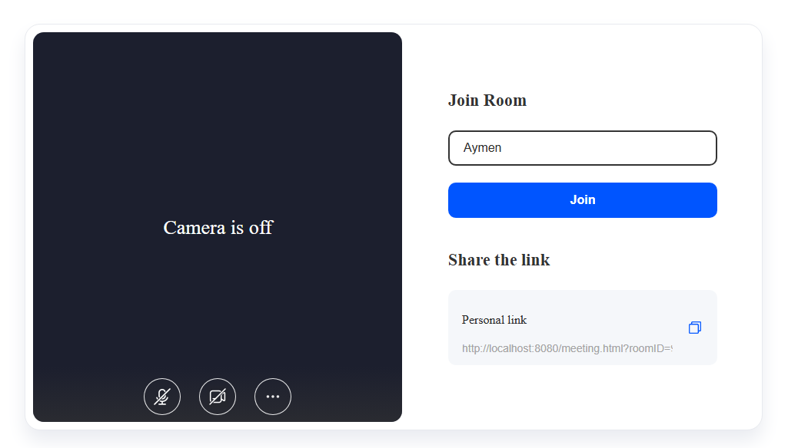
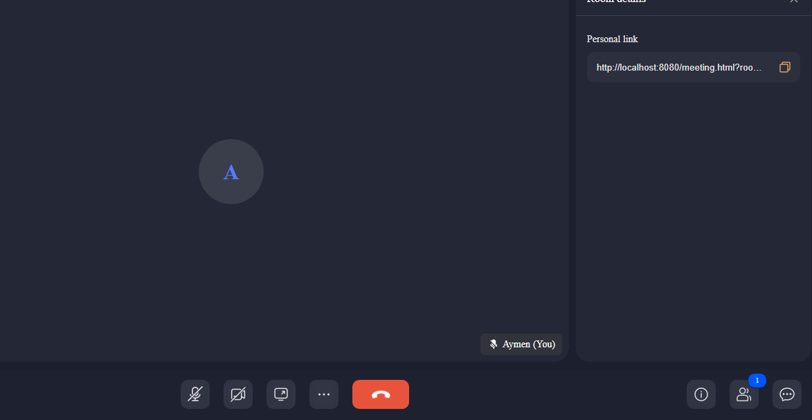
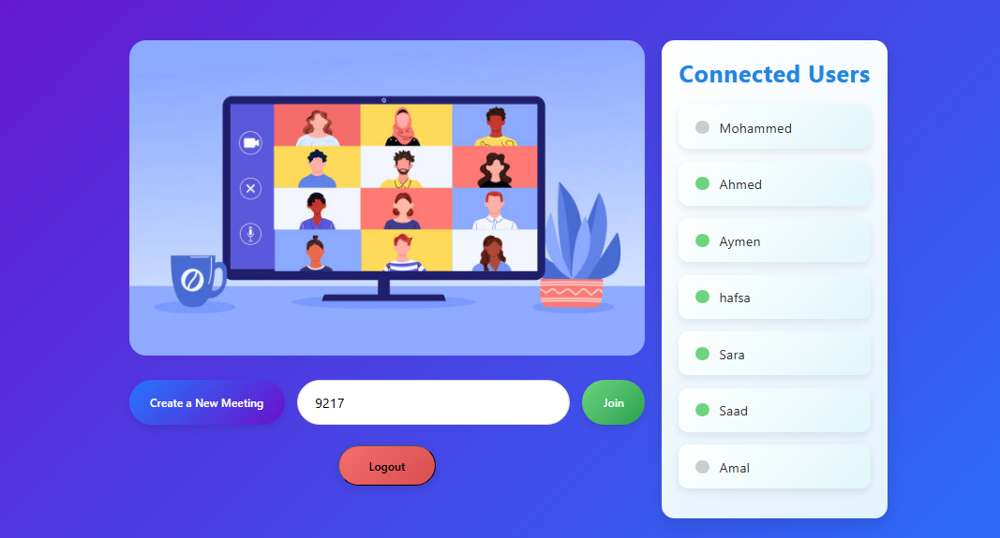
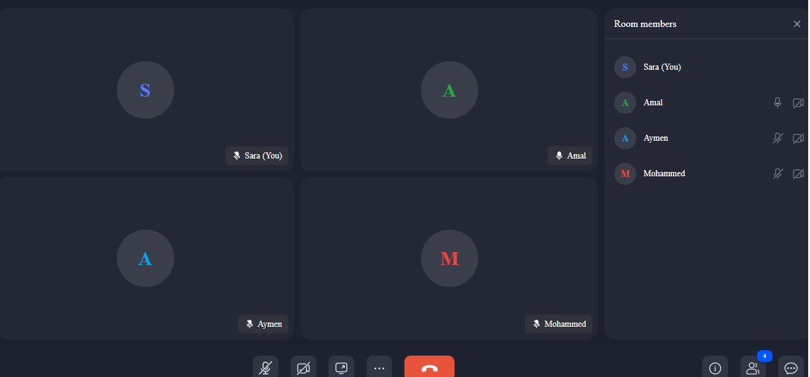

#  Online Meeting App

This is a **simple video meeting app**,built using **Spring Boot, JavaScript, and ZegoCloud**.  
It allows users to:
-  Register / Login / Logout
-  See who is online
-  Create or join meetings using **ZegoUIKitPrebuilt**
-  Chat and collaborate in real-time

---

##  How it works
1. Users login and their status is shown as **online**.
2. A user can:
    - **Create a new meeting** → generates a unique meeting room.
    - **Join a meeting** → enter the room ID and join with your username.

---

##  Requirements
- **Java 17+** and **Spring Boot** for backend
- **A ZegoCloud account** → sign up [here](https://www.zegocloud.com/)
- Create a new **Zego App** to get your:
    - `appID`
    - `serverSecret`
- the `meeting.html` file comes directly from **ZegoCloud’s sample code**.
- I downloaded it from my ZegoCloud dashboard.
- Then I **renamed it to `meeting.html`** to fit into my project.

---

##  How the App Works

1. **Register & Login** 
- New users can **sign up** or **log in** with their account.
- Once logged in, the app keeps track of your session.

  

2. **Home Page** 
    - You can see a list of **connected users** (online/offline).
    - From here, you can either **create a new meeting** or **join an existing one**.  
      

3. **Create a Meeting** 
    - Click **"Create New Meeting"** and a unique meeting page will open.
    - Share the generated link with your friends or teammates.  
      
      

4. **Join a Meeting** 
    - Copy The ID Room from the link.
    - Paste the ID to join the meeting  
      

5. **Video Meeting in Action**  
   

